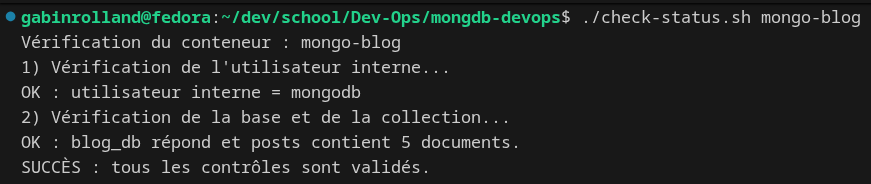
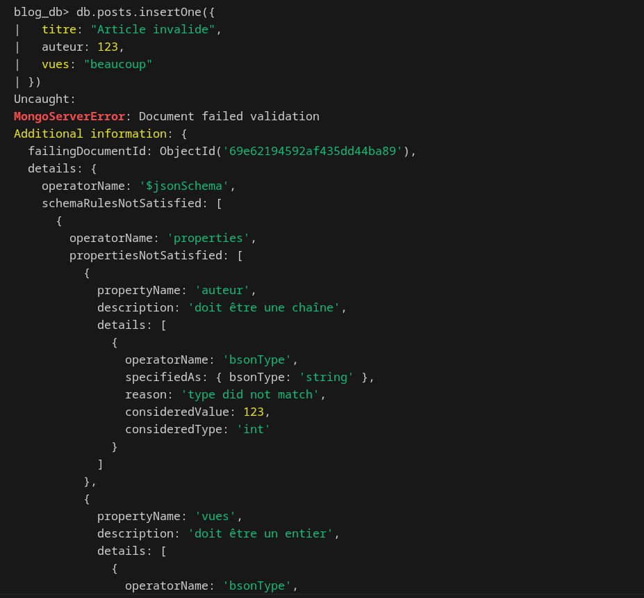
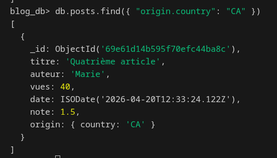
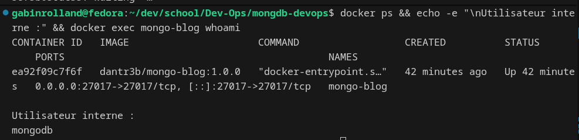

# Création d’un conteneur Mongo avec Docker

## Objectif

Créer une image Docker MongoDB personnalisée contenant automatiquement une base `blog_db` avec une collection `posts`, des données de test, et un validateur JSON Schema.

## Contenu du dépôt

- `Dockerfile`
- `docker-entrypoint-initdb.d/init-blog.js`
- `check-status.sh`
- `.env.example`
- `README.md`

## Docker Hub

[https://hub.docker.com/r/dantr3b/mongo-blog](https://hub.docker.com/r/dantr3b/mongo-blog)

```bash
docker pull dantr3b/mongo-blog:1.0.0
```

## Build

```bash
docker build -t dantr3b/mongo-blog:1.0.0 .
```

## Run

```bash
docker run -d \
  --name mongo-blog \
  -p 27017:27017 \
  --env-file .env \
  dantr3b/mongo-blog:1.0.0
```

## Verification

```bash
export $(grep -v '^#' .env | xargs)
./check-status.sh mongo-blog
```

## Screenshots








