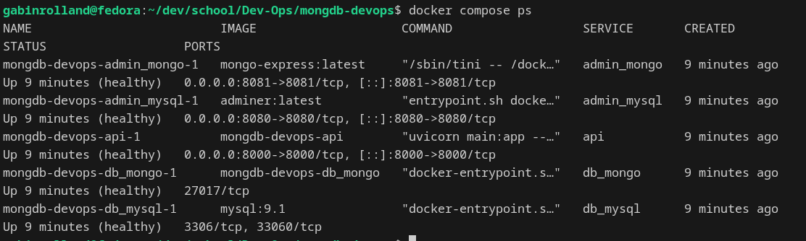
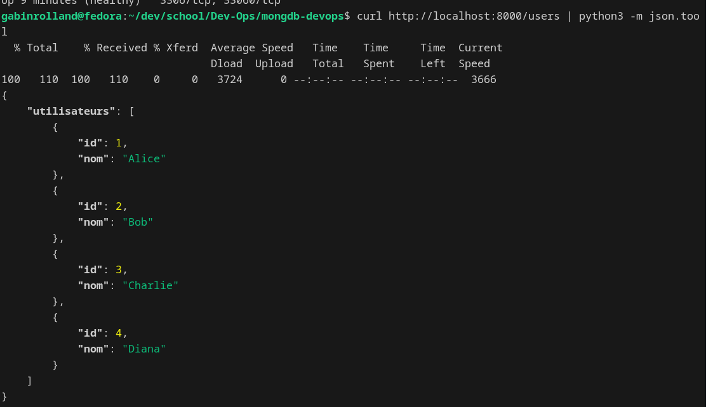
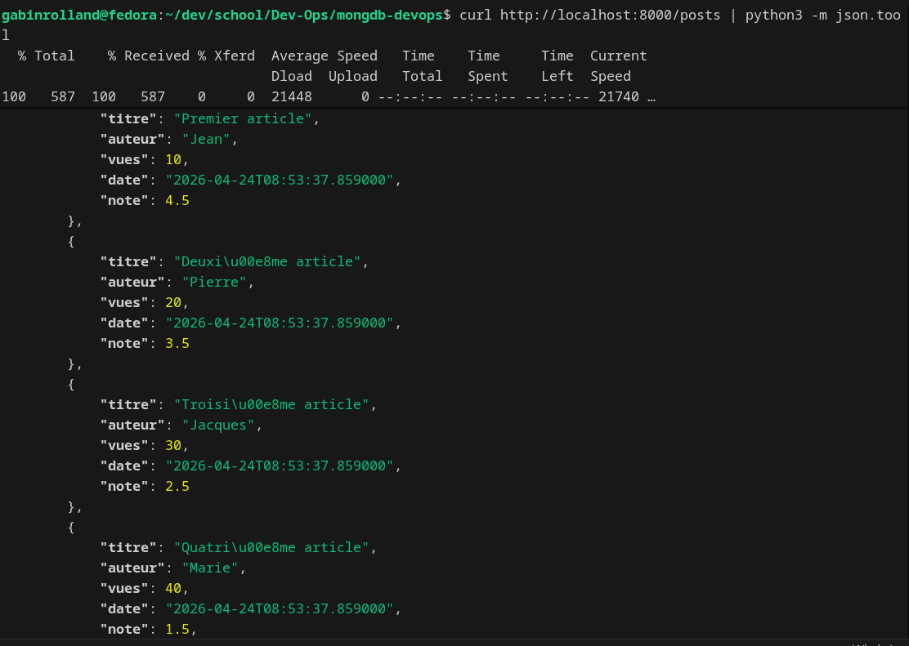

# mongdb-devops — Stack multi-BDD avec Docker Compose

## Objectif

Déployer une stack complète avec :

- Une base **MongoDB** (`blog_db`) avec une collection `posts` et un validateur JSON Schema
- Une base **MySQL** (`ynov-ci`) avec une table `utilisateurs`
- Une **API FastAPI** qui expose deux routes hybrides lisant chacune des deux BDD
- Des interfaces d'administration (**Mongo-Express**, **Adminer**)

Tous les services sont conteneurisés avec Docker Compose, supervisés par des **healthchecks** et configurés via des **volumes** (pas de `COPY` de code applicatif dans les images).

---

## Architecture

```
┌─────────────────────────────────────────────────────────┐
│                     api_network                         │
│  ┌──────────┐   ┌─────────────┐   ┌──────────────────┐  │
│  │  Adminer │   │Mongo-Express│   │   FastAPI :8000  │  │
│  │  :8080   │   │   :8081     │   │  /users /posts   │  │
│  └────┬─────┘   └──────┬──────┘   └────────┬─────────┘  │
└───────┼────────────────┼───────────────────┼────────────┘
        │           db_network               │
  ┌─────▼──────┐   ┌─────▼──────┐           │
  │  db_mysql  │   │  db_mongo  │◄──────────┘
  │  MySQL 9.1 │   │  Mongo 7.0 │
  └────────────┘   └────────────┘
```

---

## Structure du projet

```
mongdb-devops/
├── api/
│   ├── Dockerfile          # Build de l'image FastAPI
│   ├── .dockerignore
│   ├── main.py             # Routes /users, /posts, /health
│   └── requirements.txt
├── mongo/
│   ├── Dockerfile          # Image Mongo personnalisée (non-root)
│   └── init-blog.js        # Init blog_db + validateur + données
├── sql-scripts/
│   ├── migration-v001.sql  # Création de la BDD et table
│   ├── migration-v002.sql  # Données de test
│   └── migration-v003.sql  # Migrations supplémentaires
├── docker-compose.yml
├── .env                    # Variables d'environnement (non versionné)
├── env.example             # Modèle de .env
├── check-status.sh         # Script de vérification MongoDB
└── README.md
```

---

## Prérequis

- [Docker](https://docs.docker.com/get-docker/) ≥ 24
- [Docker Compose](https://docs.docker.com/compose/) ≥ 2

---

## Démarrage

### 1. Configurer l'environnement

```bash
cp env.example .env
# Editer .env avec vos valeurs
```

Contenu de `.env` :

```env
MONGO_INITDB_ROOT_USERNAME=admin
MONGO_INITDB_ROOT_PASSWORD=changeme

MYSQL_ROOT_PASSWORD=changeme
MYSQL_DATABASE=ynov-ci
```

### 2. Lancer la stack

```bash
docker compose up --build -d
```

### 3. Vérifier que tout est healthy

```bash
docker compose ps
```

Tous les services doivent afficher **(healthy)** :

| Service       | Port | Rôle                      |
| ------------- | ---- | ------------------------- |
| `db_mongo`    | —    | MongoDB (interne)         |
| `db_mysql`    | —    | MySQL (interne)           |
| `admin_mongo` | 8081 | Mongo-Express             |
| `admin_mysql` | 8080 | Adminer                   |
| `api`         | 8000 | FastAPI (routes hybrides) |

---

## Routes hybrides de l'API

### `/users` — données depuis MySQL

```bash
curl http://localhost:8000/users
```

Réponse attendue :

```json
{
  "utilisateurs": [
    { "id": 1, "nom": "Alice" },
    { "id": 2, "nom": "Bob" },
    { "id": 3, "nom": "Charlie" },
    { "id": 4, "nom": "Diana" }
  ]
}
```

### `/posts` — données depuis MongoDB

```bash
curl http://localhost:8000/posts
```

Réponse attendue :

```json
{
  "posts": [
    {"titre": "Premier article", "auteur": "Jean", "vues": 10, ...},
    ...
  ]
}
```

### `/health` — état des deux bases

```bash
curl http://localhost:8000/health
```

Réponse attendue :

```json
{ "status": "OK" }
```

---

## Interfaces d'administration

- **Mongo-Express** → [http://localhost:8081](http://localhost:8081)
- **Adminer** → [http://localhost:8080/?server=db_mysql](http://localhost:8080/?server=db_mysql)
  - Serveur : `db_mysql`
  - Utilisateur : `root`
  - Mot de passe : _(valeur de `MYSQL_ROOT_PASSWORD` dans `.env`)_
  - Base de données : `ynov-ci`

---

## Arrêter la stack

```bash
# Arrêter sans supprimer les volumes
docker compose down

# Arrêter ET supprimer les volumes
docker compose down -v
```

---

## Vérification MongoDB (script)

```bash
export $(grep -v '^#' .env | xargs)
./check-status.sh mongdb-devops-db_mongo-1
```

---

## Screenshots






